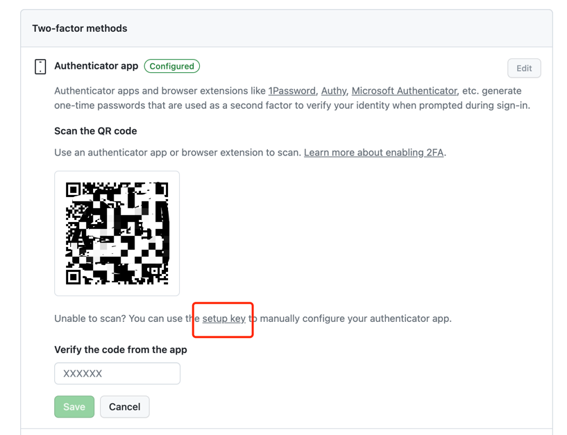

# py-TOTP

一个通过密钥生成 TOTP （Time-based One-time Password）的 Python 小工具。

## 项目起因

最近 GitHub 要求我必须开启 2FA （两步认证），不然在 45 天之后可能还会限制我登录 GitHub。好家伙，那没办法，只好去开启了呗。然而在开启的过程中发现，还需要在手机上下载 **基于时间的一次性密码 (TOTP) 移动应用** 详见 GitHub 官方 [配置 2FA](https://docs.github.com/zh/authentication/securing-your-account-with-two-factor-authentication-2fa/configuring-two-factor-authentication) 文档。
但是，我觉得下载 TOTP 移动应用程序太过于占用手机内存，并且，当我想登录 GitHub 的时候，基本上我都会用到电脑。我的设想是：我只需要将我的两步验证密钥（Base32 编码）记录到某个位置，然后每次需要登录认证时，输入到命令行中，就可以生成 TOTP 验证码了。于是，这个项目就诞生了。

如果你需要下载 TOTP 移动应用，可以考虑使用下面的几个（前三个也是 GitHub 官方推荐的）：

- [1Password](https://support.1password.com/one-time-passwords/) 没有体验过
- [Authy](https://authy.com/guides/github/) 没有体验过
- [Microsoft Authenticator](https://www.microsoft.com/en-us/account/authenticator/) 约占 188.6MB
- [Google Authenticator](https://apps.apple.com/us/app/google-authenticator/id388497605) 约占 38.1MB

如何获取两步验证的密钥？详见 GitHub 官方 [配置 2FA](https://docs.github.com/zh/authentication/securing-your-account-with-two-factor-authentication-2fa/configuring-two-factor-authentication) 文档。

- 打开 GitHub 官网，登录你的 GitHub 账号，然后点击头像，选择 **Settings**
- 选择 **Password and authentication** 选项卡，然后找到 **Two-factor authentication** 选项
- 选择 **Authenticator app** 选项，然后点击 **Edit** 选项
- 然后点击 **setup key** 即可获取两步验证密钥。如下图所示。



下面就可以尽情玩耍啦！

## 安装

- 克隆项目

```bash
git clone https://github.com/pudongping/py-TOTP.git
```

- 安装依赖

```bash
# 安装依赖
pip install -r requirements.txt
# 如果使用 [Pipenv](https://github.com/pypa/pipenv) 作为虚拟环境管理工具，则执行
pipenv install
```

## 使用

```bash
# 在项目根目录下执行
python3 main.py <your-secret>

# 你的密钥为一个 base32 编码的字符串，如：
# eg: python main.py U4VVVL5GJJSRUNMK
```

## 致谢

- [双因素认证（2FA）教程](https://ruanyifeng.com/blog/2017/11/2fa-tutorial.html)
- [pyauth/pyotp](https://github.com/pyauth/pyotp)

## 示例

你可以运行 `python3 demo.py` 来体验双因素认证全流程。